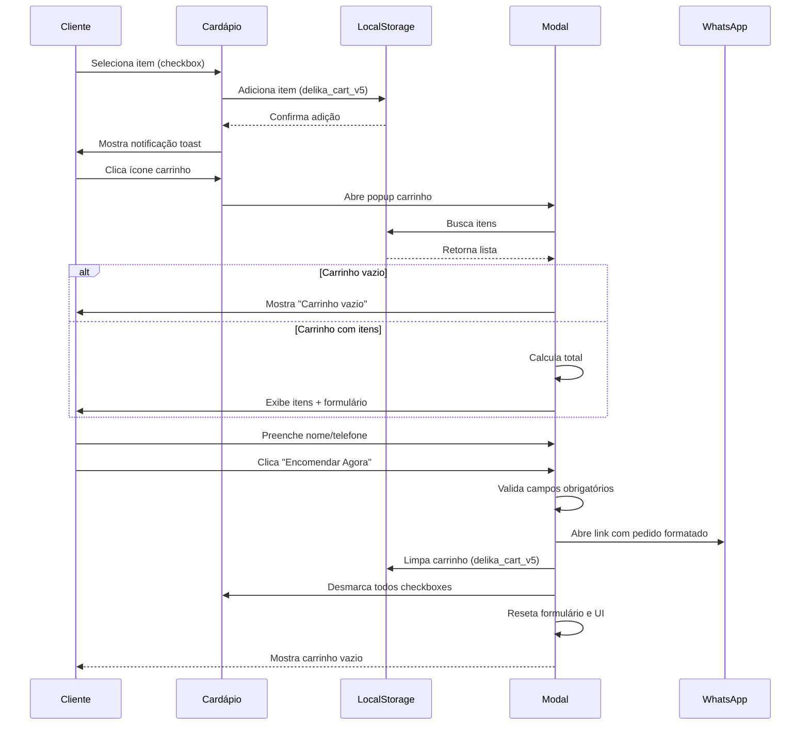

# **🍰 Deliká Bolos e Doces \- E-commerce**

## **📖 Sobre o Projeto**

O **Deliká Bolos e Doces** é um projeto de e-commerce focado na alta conversão e performance, desenvolvido para uma confeitaria local. O objetivo principal é criar uma montra digital que seja rápida, acessível e visualmente premium, destacando os produtos artesanais da Chef Karina Curvelo.

Este projeto foi desenhado sob a ótica da **Economia de Energia (Performance Web)** e **Design Responsivo**, garantindo carregamentos instantâneos mesmo em redes móveis 3G, essencial para a região de atuação.

## **🏗️ Arquitetura e Stack Tecnológica**

O projeto está a transitar de uma arquitetura estática para uma arquitetura **Jamstack** (Desacoplada), separando o Frontend da gestão de dados.

### **Fase 1: Atual (Frontend Estático)**

* **Sistema de Carrinho Avançado:**
  - Modal popup responsivo
  - Persistência via localStorage (delika_cart_v5)
  - Validação de campos obrigatórios (nome/telefone)
  - Integração direta com WhatsApp Business
  - Reset completo após cada pedido (UI + dados)
  - Cálculo automático de total
  - Notificações toast para feedback

* **HTML5 Semântico:** Estruturação limpa e acessível.  
* **CSS3 Vanilla:** Uso extensivo de CSS Grid e Flexbox, sem dependência de frameworks pesados (como Bootstrap), garantindo um peso final em KB mínimo.  
* **UI/UX Design:** Implementação de *Social Proof* (Avaliações Google) utilizando técnicas de Fallback UI estático para preservar a ética (zero mock-data) e a performance (zero scripts de terceiros).

### **Fase 2: Futura (Backend / CMS)**

* **Hospedagem (Edge Network):** [Vercel](https://vercel.com) ou [Netlify](https://netlify.com) \- Para deploy contínuo via GitHub e distribuição global rápida (CDN).  
* **Headless CMS:** [Sanity.io](https://www.sanity.io/) \- Servirá como o painel de administração (Backend/Database) onde o cliente poderá adicionar novos bolos, preços e banners promocionais sem mexer no código, comunicando com o Frontend via Fetch API.

## **📁 Estrutura de Diretórios**

D:\\TeraBoxUploud\\siteDLK\\  
├── index.html           \# Landing Page e Hero Section  
├── cardapio.html        \# Catálogo principal de produtos  
├── style.css            \# Folha de estilos global  
├── .gitignore           \# Escudo de proteção de versionamento  
├── img/                 \# Assets visuais gerais (logos, banners)  
└── itens\_cardapio/      \# Páginas de Detalhe do Produto (PDPs)

## **🎨 Decisões de Arte e Design (Direção de Arte)**

* **Paleta de Cores:** Dourado e Roxo Escuro (transmitindo sofisticação e qualidade premium).  
* **Otimização de Assets:** Transição das imagens .jpg/.png para .webp visando redução de peso em até 80% para melhor pontuação no Core Web Vitals do Google.  
* **Tipografia e Ícones:** Uso de fontes sem serifas limpas e FontAwesome para iconografia vetorial (zero impacto de peso no carregamento).

## **🚀 Como Executar o Projeto Localmente**

1. Clonar o repositório.  
2. Abrir a pasta raiz (siteDLK) no **Visual Studio Code**.  
3. Utilizar a extensão **Live Server** para emular um servidor local.  
4. O site abrirá automaticamente no navegador em http://127.0.0.1:5500.

## **📊 Diagrama de Sequência - Fluxo do Carrinho**

## **📸 Screenshots do Sistema**

*(As screenshots serão adicionadas na pasta `/docs/` após implementação completa)*

- `modal_carrinho_vazio.png` - Modal mostrando carrinho vazio
- `modal_com_itens.png` - Modal com itens selecionados  
- `modal_formulario.png` - Formulário de cliente visível
- `whatsapp_integracao.png` - Mensagem enviada para WhatsApp

## **🛠️ Próximas Evoluções**

1. **Captura de Screenshots** - Durante testes de aceitação
2. **Documentação Visual** - Inclusão no repositório `/docs/`
3. **Vídeo Demo** - Gravação do fluxo completo

*Documento gerado como parte do portfólio académico de Análise e Desenvolvimento de Sistemas (ADS). Construído por Alexandre Curvelo.*