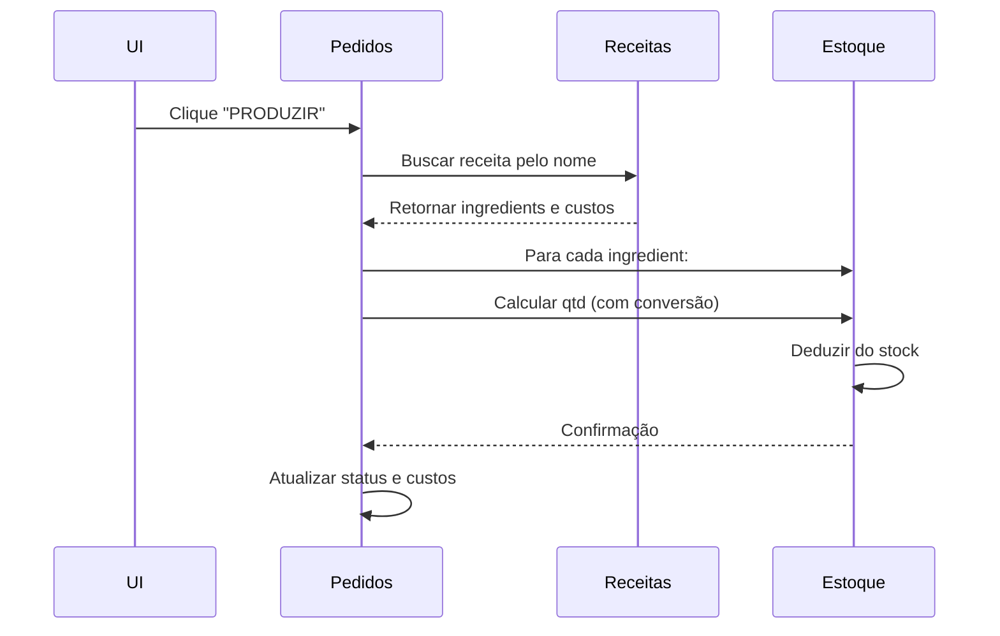

# 🧠 Manual de Arquitetura e Fluxo de Dados - ADM Deliká v1.0

**Arquiteto:** Alexandre Curvelo  
**Paradigma:** Arquitetura Local-First (Zero-Server)  
**Data:** 2026

## ?? Visão Geral

O Painel Administrativo (ADM) da Deliká não é apenas um site; é um **ERP (Enterprise Resource Planning)** de microsserviços simulados. Ele usa a memória do navegador (`localStorage`) como se fosse um Banco de Dados SQL, operando completamente offline com sincronização em tempo real na mesma máquina.

---

## 🏗️ Arquitetura Core: Local-First

### 🎯 Princípio Fundamental
```javascript
// O localStorage atua como motor de persistência
const database = {
  produtos: localStorage.getItem("delika_catalog_v5"),
  pedidos: localStorage.getItem("pedidosDelika"), 
  estoque: localStorage.getItem("delika_inventory_v5"),
  receitas: localStorage.getItem("delika_recipes_v5"),
  clientes: localStorage.getItem("delika_crm_v5")
};
```

### 📊 Mapeamento de Coleções (Tabelas Virtuais)

| Chave Storage | Tipo de Dados | Descrição |
|---------------|---------------|-----------|
| `delika_catalog_v5` | Array de objetos | Catálogo de produtos da vitrine pública |
| `pedidosDelika` | Array de objetos | Pipeline completo de encomendas |
| `delika_inventory_v5` | Array de objetos | Registro de stock e matéria-prima |
| `delika_recipes_v5` | Array de objetos | Fichas técnicas e cálculos de custo |
| `delika_crm_v5` | Array de objetos | Base de dados de clientes e endereços |
| `delika_adm_session_v1` | Objeto | Sessão de autenticação (8 horas) |

---

## 🔐 Módulo de Autenticação (`adm-auth.js`)

### 🛡️ O Guarda do Portão
```javascript
// Sistema client-side com SHA-256
async function login(username, password) {
  const hash = await sha256Hex(password);
  if (hash === "d880e32816cf14cd799f59a910be2340fc04c648b30704755fded6ea62d57b40") {
    writeSession("karina"); // Token válido por 8 horas
    return true;
  }
  return false;
}
```

### 🔑 Mecanismo de Segurança
1. **Validação**: Hash SHA-256 da password
2. **Sessão**: Token com timestamp de expiração
3. **Proteção**: Redirecionamento automático para login se sessão inválida
4. **Isolamento**: Cada página ADM chama `requireAuth()` no carregamento

---

## ⚙️ Módulos Principais e Suas Interações

### 🎯 A. Catálogo (`produtos.html`) - O Gestor da Vitrine
**Função:** Gerenciar produtos disponíveis na loja pública  
**Storage:** `delika_catalog_v5`  
**Fluxo:** Cadastro → Storage → Loja Pública (leitura automática)

### 📊 B. Ficha Técnica (`custos.html`) - A Calculadora da Empresa
**Função:** Calcular custos baseados no stock atual  
**Algoritmo Principal:**
```javascript
// CONVERSOES: dicionário de medidas culinárias
const custoTotal = receita.itens.reduce((total, ingrediente) => {
  const itemEstoque = estoque.find(i => i.id == ingrediente.insumoId);
  const fator = CONVERSOES[ingrediente.medida] || 1;
  return total + (itemEstoque.preco * fator * ingrediente.qtd);
}, 0);
```

### 🚀 C. Kanban de Pedidos (`pedidos.html`) - O Cérebro do Sistema
**Função:** Orquestrar produção e baixa automática de stock  
**Evento Principal:** Mover pedido para "Em Produção"

#### ?? Fluxo de Baixa Automática


### 📈 D. Dashboard (`painel.html`) - O Radar Executivo
**Função:** Monitoramento passivo (somente leitura)  
**Métricas:**
- Contagem de produtos ativos
- Visitas simuladas (para demonstração)
- Mensagens recebidas via WhatsApp

---

## ⚠️ Avaliação de Riscos e Limitações

### 🚨 Limitação Crítica (Calcanhar de Aquiles)
**Problema:** Dados vivem fisicamente no navegador específico  
**Impacto:** 
- Perda total se limpar cache/histórico
- Não sincroniza entre dispositivos
- Sem backup automático

### 🎯 Justificativa para Evolução v2.0
A arquitetura Local-First serve como **Protótipo de Alta Fidelidade**, mas a versão de produção requer:

1. **Firebase Firestore** - Sincronização em tempo real
2. **Firebase Authentication** - Segurança robusta
3. **Cloud Functions** - Lógica de negócio server-side
4. **Backup Automático** - Prevenção de perda de dados

---

## 🎨 Design System e UX

### 🎨 Paleta Corporativa
```css
:root {
  --roxo-delika: #6b2d8c;     /* Identidade principal */
  --roxo-escuro: #311440;     /* Elementos destacados */
  --dourado: #d4af37;         /* Ações premium */
  --lilas-claro: #f3e5f5;     /* Fundos suaves */
}
```

### 📱 Responsividade
- Sidebar colapsável em mobile
- Grid adaptativo para kanban
- Touch-friendly para produção

---

## 🔮 Roadmap de Evolução

### 🚀 v2.0 - Arquitetura Cloud-Native
1. **Migração para Firebase** - Sincronização multi-dispositivo
2. **PWA Offline-First** - Funcionalidade sem internet
3. **Relatórios Analytics** - Métricas de performance real
4. **Integração WhatsApp Business API** - Mensagens automatizadas

### 🎯 v3.0 - Inteligência de Negócio
1. **Previsão de Stock** - Machine Learning para reposição
2. **Sazonalidade** - Alertas para datas comemorativas
3. **CRM Inteligente** - Clientes recorrentes e preferências

---

## 📋 Checklist de Implantação

### ✅ Funcionalidades Implementadas
- [x] Autenticação client-side segura
- [x] Gestão completa de produtos
- [x] Cálculo automático de custos
- [x] Baixa de stock integrada
- [x] Dashboard de monitoramento
- [x] Interface responsiva

### ⚠️ Requisitos de Ambiente
- Navegador moderno com suporte a localStorage
- JavaScript habilitado
- Conexão inicial para carregamento de recursos
- **Não limpar cache do navegador**

---

*Documento técnico preparado para transição de arquitetura e documentação do sistema existente.*  
**📧 Contacto:** Alexandre Curvelo - Arquitetura de Software